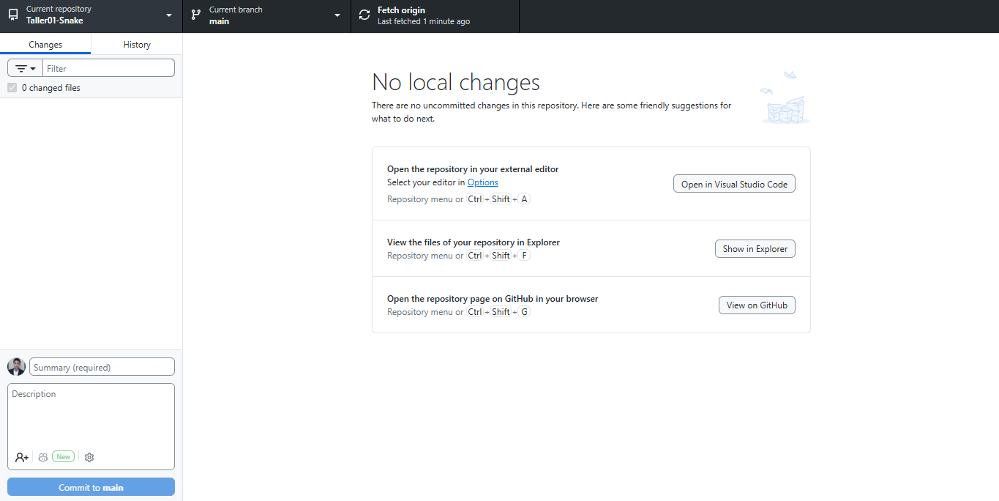
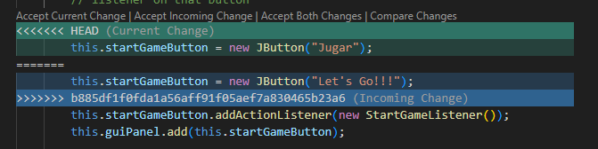
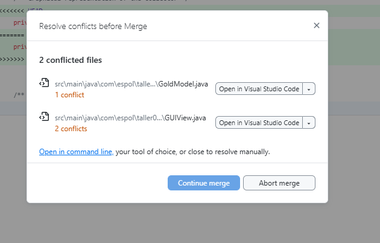
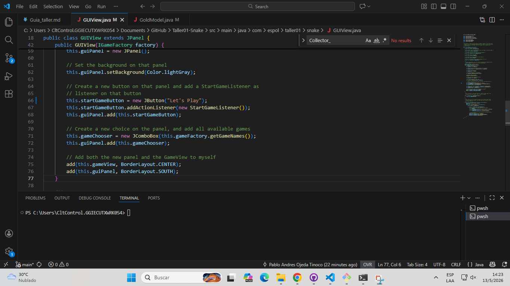
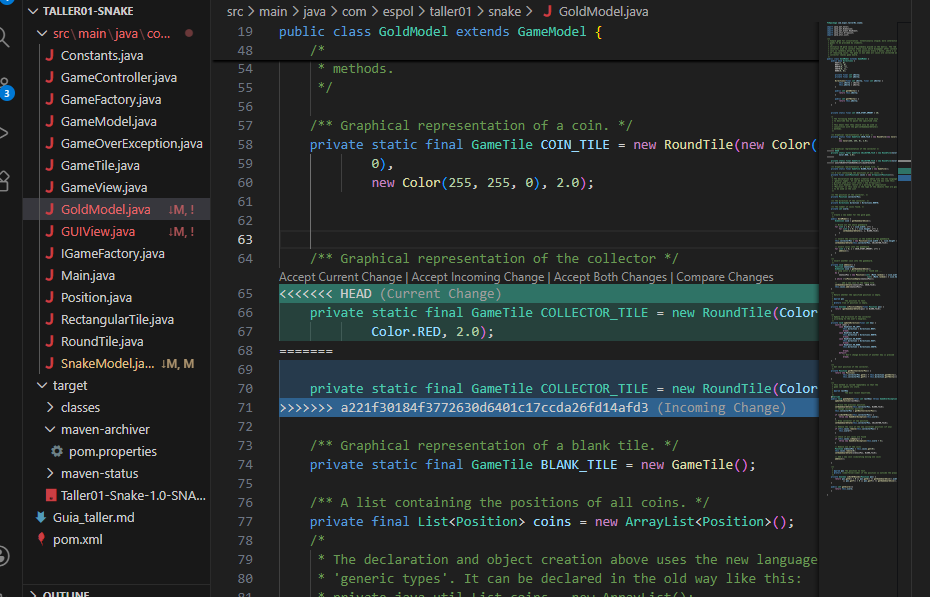
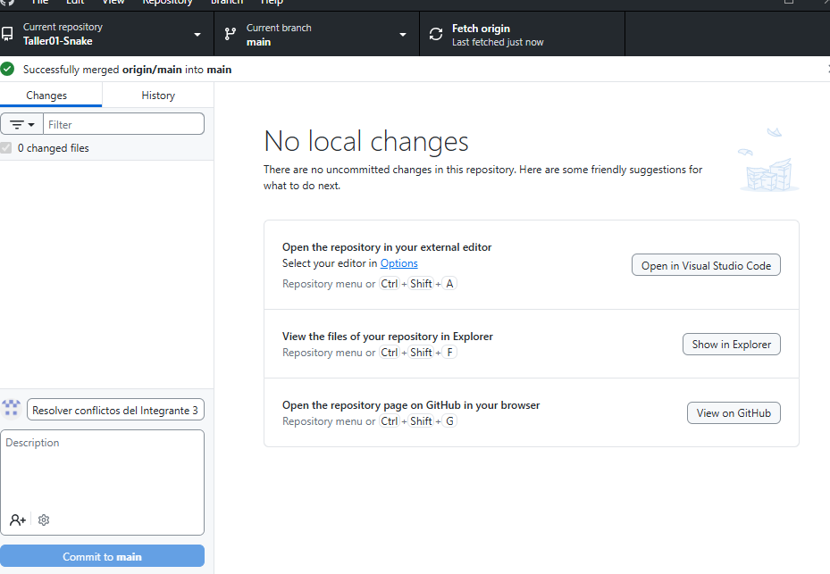

## Integrantes y roles
| Rol | Nombre | Usuario de GitHub | Commit principal |
| --- | --- | --- | --- |
| Líder | Ojeda Tinoco Pablo Andres | AnderFX | Agregar código base del taller (Ref: 948c78b) |
| Integrante 1 | Negrete Alvarado Daniel Jose | danegret | cambiar botón y cabeza de snake (Ref: d01bddc) |
| Integrante 2 | Inga Ontaneda Angie Liliana | Angie_Inga | cambiar botón y colector de gold (Ref: 5f126f7) |
| Integrante 3 | Chavez Zavala Johny Josue | johnny-chavez | cambiar botón y color del colector (Ref: dd4936c) |
## Evidencias
```markdown
### Líder

Push exitoso:



### Integrante 1

Error antes de resolver conflicto:



Push exitoso después de resolver conflicto:


### Integrante 2

Error antes de resolver conflicto:



Push exitoso después de resolver conflicto:



### Integrante 3

Error antes de resolver conflicto:



Push exitoso después de resolver conflicto:


```
